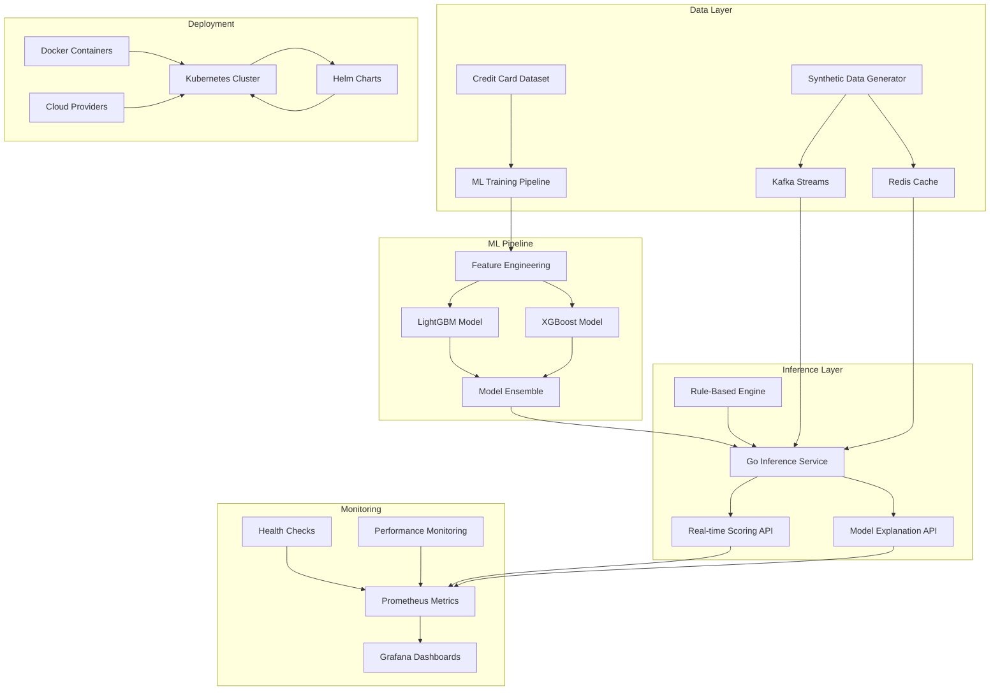

# 🛡️ Real-Time Fraud Detection System

[](https://opensource.org/licenses/MIT)
[](https://golang.org/)
[](https://python.org/)
[](https://kubernetes.io/)
[](https://docker.com/)

A **production-ready, enterprise-grade fraud detection system** that demonstrates advanced MLOps capabilities with real-time inference, comprehensive monitoring, and cloud-native deployment. This system combines machine learning models with rule-based detection to provide sub-100ms fraud scoring for financial transactions.

## 🏗️ Architecture Overview



## 🚀 Key Features

### 🔬 Advanced Machine Learning
- **Ensemble Learning**: Combines LightGBM, XGBoost, and an unsupervised Isolation Forest anomaly detector, blended into a single weighted score
- **Class Imbalance Handling**: SMOTE, class weights, and balanced sampling techniques
- **Probability Calibration**: `CalibratedClassifierCV` (Platt scaling) so scores are real probabilities a policy can threshold, not raw GBM margins
- **Feature Engineering**: 20+ derived features including time-based, amount-based, and statistical features
- **Model Interpretability**: Real per-transaction SHAP values (`shap.TreeExplainer`), not a global-importance heuristic
- **Cross-Validation**: Stratified K-fold validation for robust model evaluation

### 💳 Credit Risk Decisioning
- **Actionable Decisions**: Turns a fraud score into approve / step-up-review / decline, not just a probability
- **Credit Limit Policy**: Explainable limit-adjustment logic driven by risk, utilization, and delinquency history
- **Human-in-the-Loop Review**: A persisted case queue for borderline transactions, with analyst approve/decline resolution
- **Case Narratives**: Auto-generated, analyst-memo-style summaries from the SHAP explanation and policy reason codes
- **SQL-Backed Analytics**: Every decision is logged to an auditable SQLite store; `analytics/sql/` answers real risk-strategy questions (loss rate by score decile, approval funnel, threshold trade-offs, review queue aging)
- **Review Console**: A React dashboard for scoring transactions, working the review queue, and watching live model/policy analytics

### ⚡ High-Performance Inference
- **Sub-100ms Latency**: Go-based inference service for real-time predictions
- **Hybrid Detection**: Combines rule-based and ML-based approaches
- **Concurrent Processing**: Handles multiple requests simultaneously
- **Graceful Degradation**: Fallback mechanisms for model failures
- **Health Monitoring**: Comprehensive health checks and status endpoints

### 📊 Production Monitoring
- **Real-time Metrics**: Prometheus integration with custom fraud detection metrics
- **Performance Dashboards**: Grafana visualization for system health
- **Model Drift Detection**: Automated monitoring of model performance degradation
- **Alerting**: Configurable alerts for system anomalies
- **Distributed Tracing**: Request tracing across microservices

### ☁️ Cloud-Native Deployment
- **Multi-Cloud Support**: AWS EKS, GCP GKE, Azure AKS
- **Auto-scaling**: Horizontal Pod Autoscaler based on CPU/memory usage
- **Service Mesh Ready**: Compatible with Istio for advanced networking
- **Security**: RBAC, network policies, and secrets management
- **CI/CD Integration**: GitOps-ready with ArgoCD support

## 📁 Project Structure

```
fraud-detection/
├── 📁 python-ml/                 # ML Training + Serving
│   ├── 📁 src/                   # Source code
│   │   ├── models.py            # LightGBM/XGBoost + Isolation Forest, calibration, SHAP
│   │   ├── serve.py             # FastAPI sidecar: /predict, /explain, /decision, /cases, /analytics
│   │   ├── credit_decisioning.py # Score -> approve/review/decline + credit-limit policy
│   │   ├── narrative.py         # Templated case-narrative generator
│   │   ├── audit_log.py         # SQLite decision audit log + analytics queries
│   │   └── data_generator.py    # Synthetic data generation
│   ├── 📁 tests/                # pytest suite for all of the above
│   ├── 📁 notebooks/            # Jupyter notebooks for analysis
│   ├── 📁 models/               # Trained model artifacts
│   ├── 📁 data/                 # Training datasets
│   ├── train.py                 # Main training script
│   ├── requirements.txt         # Python dependencies
│   └── Dockerfile              # ML training + serving container
├── 📁 go-inference/             # Inference / Decisioning API
│   ├── 📁 cmd/server/          # Main application
│   ├── 📁 internal/            # Internal packages
│   │   ├── 📁 api/             # HTTP handlers (score, explain, decision, cases, analytics)
│   │   ├── 📁 ml/              # Predictors, ml-serving HTTP client
│   │   └── 📁 models/          # Data models
│   ├── go.mod                  # Go module definition
│   └── Dockerfile             # Inference service container
├── 📁 frontend/                 # Decision console (React + TypeScript + Vite)
│   ├── 📁 src/
│   │   ├── App.tsx             # Tab shell: Decision Console / Review Queue / Analytics
│   │   ├── api.ts              # Typed client for the Go API
│   │   └── 📁 components/      # Transaction form, SHAP chart, review queue, dashboard
│   └── Dockerfile              # nginx-served production build
├── 📁 analytics/                # Credit risk / fraud analyst SQL reports
│   ├── 📁 sql/                  # approval_funnel, loss_rate_by_score_decile, threshold_tradeoff, review_queue_aging
│   └── run_report.py            # Runs the .sql files against the audit log and prints them
├── 📁 data-generator/          # Data Generation Service
│   ├── 📁 src/                # Source code
│   ├── 📁 config/             # Configuration files
│   ├── requirements.txt       # Python dependencies
│   └── Dockerfile            # Data generator container
├── 📁 monitoring/             # Monitoring Stack
│   ├── 📁 prometheus/         # Prometheus configuration
│   ├── 📁 grafana/           # Grafana dashboards
│   │   ├── 📁 dashboards/    # Custom dashboards
│   │   └── 📁 provisioning/  # Auto-provisioning config
│   └── 📁 dashboards/        # Additional monitoring configs
├── 📁 k8s/                   # Raw Kubernetes manifests (non-Helm path)
│   ├── configmaps.yaml      # ConfigMaps (Prometheus scrape config, etc.)
│   ├── secrets.yaml         # Secrets
│   └── namespaces.yaml      # Namespace definitions
├── 📁 helm/                  # Helm Charts (inference-api, ml-serving, frontend, ml-training, data-generator + Kafka/Redis/Prometheus/Grafana)
│   └── 📁 fraud-detection/   # Main Helm chart
│       ├── 📁 templates/     # K8s templates
│       ├── Chart.yaml        # Chart metadata
│       ├── values.yaml       # Default values
│       ├── values-aws.yaml   # AWS-specific values
│       ├── values-gcp.yaml   # GCP-specific values
│       └── values-azure.yaml # Azure-specific values
├── 📁 scripts/               # Utility Scripts
│   ├── create-cluster-aws.sh # AWS cluster creation
│   ├── deploy.sh            # Deployment script
│   └── seed_audit_log.py    # Seeds realistic historical decisions for analytics/the review queue
├── 📁 .github/workflows/     # CI: Go tests, Python tests, frontend tests, analytics SQL tests
├── 📁 docs/                  # Documentation
├── 📁 examples/              # Usage examples
├── docker-compose.yml        # Local development setup
├── README.md                # This file
└── .gitignore              # Git ignore rules
```

## 🛠️ Technology Stack

### Machine Learning
- **Python 3.9+**: Core ML development
- **LightGBM**: Gradient boosting framework
- **XGBoost**: Extreme gradient boosting
- **scikit-learn**: ML utilities and preprocessing
- **pandas**: Data manipulation and analysis
- **numpy**: Numerical computing
- **imbalanced-learn**: Class imbalance handling

### Backend Services
- **Go 1.19+**: High-performance inference service
- **Gin**: HTTP web framework
- **Logrus**: Structured logging
- **Prometheus**: Metrics collection

### Data & Streaming
- **Apache Kafka**: Message streaming
- **Redis**: Caching and real-time data
- **PostgreSQL**: Persistent data storage (optional)

### Infrastructure
- **Kubernetes**: Container orchestration
- **Docker**: Containerization
- **Helm**: Package management
- **Prometheus**: Monitoring and alerting
- **Grafana**: Visualization and dashboards

### Cloud Providers
- **AWS**: EKS, S3, IAM, CloudWatch
- **GCP**: GKE, GCS, Workload Identity, Stackdriver
- **Azure**: AKS, Blob Storage, Managed Identity, Application Insights

## 🚀 Quick Start

### Prerequisites

- **Docker & Docker Compose**: For local development
- **Kubernetes Cluster**: 
  - Local: [minikube](https://minikube.sigs.k8s.io/), [kind](https://kind.sigs.k8s.io/), or [k3s](https://k3s.io/)
  - Cloud: AWS EKS, GCP GKE, or Azure AKS
- **Helm 3.x**: Package manager for Kubernetes
- **Python 3.9+**: For ML training
- **Go 1.19+**: For inference service
- **kubectl**: Kubernetes command-line tool

### 🏃‍♂️ Local Development

1. **Clone the repository**
   ```bash
   git clone https://github.com/VarunSUK/fraud-detector.git
   cd fraud-detector
   ```

2. **Start local infrastructure**
   ```bash
   # Start Kafka, Redis, Prometheus, and Grafana
   docker-compose up -d kafka redis prometheus grafana
   
   # Wait for services to be ready
   docker-compose logs -f kafka
   ```

3. **Train the ensemble and seed some history**
   ```bash
   cd python-ml
   pip install -r requirements.txt
   cd ..

   # Trains LightGBM + XGBoost + Isolation Forest on synthetic creditcard-shaped
   # data, then scores a batch of historical transactions through the credit
   # risk policy so analytics/ and the review queue have real data to show.
   python scripts/seed_audit_log.py --models-dir python-ml/models --db audit_log.db --train

   # To train against the real Kaggle creditcard.csv dataset instead:
   # python python-ml/train.py --data-file creditcard.csv --dataset-type creditcard --models-dir python-ml/models
   ```

4. **Run the ML serving sidecar**
   ```bash
   cd python-ml
   MODELS_DIR=models AUDIT_DB_PATH=../audit_log.db uvicorn serve:app --app-dir src --port 8000
   ```

5. **Run the inference / decisioning API**
   ```bash
   cd go-inference
   go mod tidy
   ML_SERVICE_URL=http://localhost:8000 go run cmd/server/main.go
   ```

6. **Run the frontend**
   ```bash
   cd frontend
   npm install
   VITE_API_BASE_URL=http://localhost:8080 npm run dev
   # open http://localhost:5173
   ```

7. **Run the SQL analyst reports** (optional, no server needed)
   ```bash
   python analytics/run_report.py --db audit_log.db
   ```

8. **Generate synthetic streaming data** (optional, exercises Kafka/Redis)
   ```bash
   cd data-generator
   pip install -r requirements.txt
   python src/stream_producer.py --kafka --redis --sample-rate 0.01
   ```

### ☁️ Kubernetes Deployment

1. **Deploy with Helm (AWS)**
   ```bash
   # Add required Helm repositories
   helm repo add prometheus-community https://prometheus-community.github.io/helm-charts
   helm repo add grafana https://grafana.github.io/helm-charts
   helm repo update
   
   # Deploy the fraud detection system
   helm install fraud-detection ./helm/fraud-detection \
     --set cloud.provider=aws \
     --set cloud.region=us-west-2 \
     --set cloud.aws.s3.bucket=your-models-bucket
   ```

2. **Deploy to GCP**
   ```bash
   helm install fraud-detection ./helm/fraud-detection \
     --set cloud.provider=gcp \
     --set cloud.region=us-west1 \
     --set cloud.gcp.gcs.bucket=your-models-bucket
   ```

3. **Deploy to Azure**
   ```bash
   helm install fraud-detection ./helm/fraud-detection \
     --set cloud.provider=azure \
     --set cloud.region=westus2 \
     --set cloud.azure.blob.container=your-models-container
   ```

## 📡 API Documentation

### Base URL
- **Local**: `http://localhost:8080`
- **Kubernetes**: `http://fraud-detection-api.your-domain.com`

### Authentication
Currently, the API is open for development. In production, implement:
- API keys
- OAuth 2.0
- JWT tokens
- mTLS

### Endpoints

#### 🎯 Score Transaction
**POST** `/api/v1/score`

Real-time fraud scoring for individual transactions.

**Request Body:**
```json
{
  "transaction_id": "txn_123456789",
  "amount": 1500.00,
  "merchant": "electronics_store",
  "card_type": "credit",
  "hour": 14,
  "day_of_week": 1,
  "is_weekend": false,
  "previous_transactions": 5,
  "avg_amount": 250.00,
  "max_amount": 1000.00,
  "location_country": "US",
  "device_type": "mobile",
  "time": 1640995200
}
```

**Response:**
```json
{
  "transaction_id": "txn_123456789",
  "score": 0.85,
  "prediction": 1,
  "probability": 0.85,
  "model": "ensemble",
  "timestamp": "2024-01-01T12:00:00Z",
  "processing_ms": 45
}
```

#### 🔍 Explain Prediction
**POST** `/api/v1/explain`

Get detailed explanation of fraud prediction with feature attribution.

**Request Body:**
```json
{
  "transaction": {
    "transaction_id": "txn_123456789",
    "amount": 1500.00,
    "merchant": "electronics_store",
    "card_type": "credit",
    "hour": 14,
    "day_of_week": 1,
    "is_weekend": false,
    "previous_transactions": 5,
    "avg_amount": 250.00,
    "max_amount": 1000.00,
    "location_country": "US",
    "device_type": "mobile",
    "time": 1640995200
  }
}
```

**Response:**
```json
{
  "transaction_id": "txn_123456789",
  "score": 0.85,
  "prediction": 1,
  "feature_contributions": [
    {
      "feature": "amount_to_avg_ratio",
      "value": 6.0,
      "importance": 0.25,
      "contribution": 0.15
    },
    {
      "feature": "unusual_time",
      "value": 1,
      "importance": 0.20,
      "contribution": 0.20
    }
  ],
  "model": "ensemble",
  "timestamp": "2024-01-01T12:00:00Z",
  "processing_ms": 12
}
```

#### 🏥 Health Check
**GET** `/health`

Check service health and model availability.

**Response:**
```json
{
  "status": "healthy",
  "timestamp": "2024-01-01T12:00:00Z",
  "version": "1.0.0",
  "models": ["ensemble", "lightgbm", "xgboost", "rule_based"]
}
```

#### 📊 Available Models
**GET** `/api/v1/models`

Get information about available models.

**Response:**
```json
{
  "models": [
    {
      "name": "ensemble",
      "type": "ensemble",
      "features": ["combined_features"],
      "metrics": {
        "num_models": 3
      },
      "loaded_at": "2024-01-01T12:00:00Z"
    }
  ],
  "count": 1
}
```

#### 💳 Credit Risk Decision
**POST** `/api/v1/decision`

Scores a transaction, applies the credit risk policy, records it to the audit log, and returns an actionable result plus an analyst narrative -- what a credit risk workflow actually consumes, not just a probability.

**Request Body:**
```json
{
  "transaction": {
    "transaction_id": "txn_123456789",
    "amount": 2500.00,
    "time": 90000,
    "v14": -3.2, "v4": 2.1
  },
  "account": {
    "credit_limit": 5000,
    "current_balance": 1000,
    "account_age_days": 400,
    "delinquent_payments_count": 0,
    "avg_monthly_spend": 800
  }
}
```

**Response:**
```json
{
  "transaction_id": "txn_123456789",
  "fraud_score": 0.74,
  "action": "step_up_review",
  "risk_tier": "medium",
  "reason_codes": ["ELEVATED_FRAUD_SCORE"],
  "credit_limit_recommendation": { "current": 5000, "recommended": 5000, "adjustment_pct": 0 },
  "narrative": "txn_123456789 scored 0.74 and was routed to manual review (medium risk). Policy triggers: ELEVATED_FRAUD_SCORE. Top model signals: V14 (+2.98); amount_log (+2.53); Amount (+0.88).",
  "feature_contributions": [ { "feature": "V14", "value": -3.2, "importance": 2.98, "contribution": 2.98 } ],
  "model_scores": { "lightgbm": 0.91, "xgboost": 0.71, "isolation_forest": 0.47 }
}
```

#### 🗂️ Review Queue
**GET** `/api/v1/cases` -- lists pending `step_up_review` decisions awaiting an analyst verdict.

**POST** `/api/v1/cases/:id/resolve` -- records the verdict:
```json
{ "verdict": "approve", "is_actual_fraud": false }
```

#### 📈 Analytics Summary
**GET** `/api/v1/analytics/summary`

Live approval funnel and fraud-rate-by-score-decile breakdown, computed from the audit log (same queries as `analytics/sql/approval_funnel.sql` and `loss_rate_by_score_decile.sql`). For deeper ad hoc analysis -- threshold trade-offs, review queue aging -- run `python analytics/run_report.py` directly against the database.

## 📊 Monitoring & Observability

### Prometheus Metrics

The system exposes comprehensive metrics:

- **Request Metrics**: `fraud_detection_requests_total`, `fraud_detection_request_duration_seconds`
- **Prediction Metrics**: `fraud_detection_predictions_total`
- **Model Metrics**: `fraud_detection_model_load_time_seconds`
- **System Metrics**: CPU, memory, disk usage

### Grafana Dashboards

Access Grafana at `http://localhost:3000` (admin/admin) to view:

- **Real-time Fraud Detection**: Transaction volume, fraud rate, model performance
- **System Performance**: Latency, throughput, error rates
- **Model Health**: Model accuracy, drift detection, feature importance
- **Infrastructure**: Resource utilization, pod health, network metrics

### Alerting Rules

Configure alerts for:
- High fraud rate (>5%)
- Model accuracy degradation (>10% drop)
- High latency (>200ms)
- Service unavailability
- Resource exhaustion

## 🔧 Configuration

### Environment Variables

#### ML Training Service
```bash
PYTHONPATH=/app/src
PYTHONUNBUFFERED=1
DATA_FILE=/app/data/creditcard.csv
MODELS_DIR=/app/models
OUTPUT_DIR=/app/output
```

#### Inference Service
```bash
PORT=8080
MODELS_DIR=/app/models
LOG_LEVEL=info
VERSION=1.0.0
```

#### Data Generator
```bash
KAFKA_BOOTSTRAP_SERVERS=localhost:9092
REDIS_HOST=localhost
REDIS_PORT=6379
SAMPLE_RATE=0.01
```

### Helm Values

Key configuration options in `values.yaml`:

```yaml
# Resource limits
inferenceAPI:
  resources:
    limits:
      cpu: 1000m
      memory: 2Gi
    requests:
      cpu: 500m
      memory: 1Gi

# Scaling configuration
inferenceAPI:
  replicaCount: 3
  autoscaling:
    enabled: true
    minReplicas: 2
    maxReplicas: 10
    targetCPUUtilizationPercentage: 70

# Monitoring
monitoring:
  enabled: true
  prometheus:
    retention: "15d"
  grafana:
    adminPassword: "secure-password"
```

## 🧪 Testing

### Unit Tests
```bash
# Python tests (models, serving, credit decisioning, narrative, audit log)
cd python-ml
python -m pytest tests/ -v

# Go tests (handlers, predictors, ensemble, router)
cd go-inference
go test ./... -v

# Frontend tests (sample-data generation, API client)
cd frontend
npm test

# Analytics SQL reports (schema/syntax regression guard)
python -m pytest analytics/test_run_report.py -v
```

All four run in CI on every push -- see `.github/workflows/ci.yml`.

### Integration Tests
```bash
./scripts/run-integration-tests.sh
```
Trains a small real model set, boots the ml-serving sidecar and go-inference as real local processes (no Docker needed), and exercises the actual HTTP contract between them end to end -- health, score, explain, decision, cases, analytics, and the real `/metrics` Prometheus output. Cleans up after itself.

`./scripts/run-tests.sh` runs this plus all four unit test suites (Go, Python, frontend, analytics SQL) in one command.

### Load Testing
```bash
brew install k6   # or see https://k6.io/docs/get-started/installation/
k6 run tests/load-test.js
# against a non-local target:
BASE_URL=https://staging.example.com k6 run tests/load-test.js
```
Targets `/api/v1/score` specifically, not `/api/v1/decision` -- see [docs/deployment.md](docs/deployment.md) for why decision (which writes to the SQLite audit log on every call) isn't the thing to hammer with concurrent virtual users. This test is also what surfaced a real thundering-herd bug in the sidecar health-check cache under concurrent load -- see [docs/troubleshooting.md](docs/troubleshooting.md).

## 🚀 Performance

Run `k6 run tests/load-test.js` (see [Load Testing](#load-testing) above) against your own environment for real numbers -- hardware, model size, and network topology (same-host vs. cross-AZ sidecar calls) all matter enough that a single "the system does Xms" claim isn't meaningful without them. What we can say from actually running it during development:

- Per-request latency is dominated by the go-inference → ml-serving HTTP hop and the SHAP computation inside it, not by the rule-based path or the network itself.
- Under concurrent load, a stale-cache thundering-herd bug in the sidecar health check caused real, measurable tail-latency spikes -- see [docs/troubleshooting.md](docs/troubleshooting.md) for the finding and the fix (`TestMLServicePredictor_ConcurrentIsLoadedDoesNotStampede` guards against a regression). That's the kind of thing load testing is for: it's a genuine bug the unit tests couldn't have caught.
- Accuracy numbers (AUC, etc.) depend entirely on the dataset you train on -- `python-ml/src/synthetic_creditcard.py`'s toy data is deliberately *not* meant to produce an impressive-looking AUC (see [docs/ml-pipeline.md](docs/ml-pipeline.md) for why); train against the real Kaggle creditcard.csv or your own data for numbers worth reporting.

## 🔒 Security Considerations

### Data Protection
- **Encryption at Rest**: All data encrypted using AES-256
- **Encryption in Transit**: TLS 1.3 for all communications
- **PII Handling**: No sensitive data stored in logs
- **Data Retention**: Configurable retention policies

### Access Control
- **RBAC**: Role-based access control in Kubernetes
- **Network Policies**: Restrictive network policies
- **Service Accounts**: Dedicated service accounts for each component
- **Secrets Management**: Kubernetes secrets or external secret managers

### Model Security
- **Model Signing**: Cryptographic signatures for model integrity
- **Version Control**: Immutable model versions
- **Access Logging**: Comprehensive audit trails
- **Input Validation**: Strict input validation and sanitization

## 🤝 Contributing

We welcome contributions! Please follow these steps:

1. **Fork the repository**
2. **Create a feature branch**
   ```bash
   git checkout -b feature/amazing-feature
   ```
3. **Make your changes**
4. **Add tests** for new functionality
5. **Run the test suite**
   ```bash
   ./scripts/run-tests.sh
   ```
6. **Commit your changes**
   ```bash
   git commit -m 'Add amazing feature'
   ```
7. **Push to your branch**
   ```bash
   git push origin feature/amazing-feature
   ```
8. **Open a Pull Request**

### Development Guidelines

- **Code Style**: Follow Go and Python style guides
- **Documentation**: Update README and code comments
- **Testing**: Maintain >80% test coverage
- **Security**: Follow security best practices
- **Performance**: Consider performance implications

## 📚 Additional Resources

### Documentation
- [ML Pipeline Guide](docs/ml-pipeline.md)
- [Deployment Guide](docs/deployment.md)
- [API Reference](docs/api-reference.md)
- [Troubleshooting](docs/troubleshooting.md)

### Examples
- [Basic Usage](examples/basic-usage.py)
- [Advanced Configuration](examples/advanced-config.yaml)
- [Custom Models](examples/custom-models.md)

### Community
- [GitHub Discussions](https://github.com/VarunSUK/fraud-detector/discussions)
- [Issue Tracker](https://github.com/VarunSUK/fraud-detector/issues)
- [Wiki](https://github.com/VarunSUK/fraud-detector/wiki)

## 📄 License

This project is licensed under the MIT License - see the [LICENSE](LICENSE) file for details.

## 🙏 Acknowledgments

- **LightGBM Team** for the excellent gradient boosting framework
- **XGBoost Team** for the powerful ML library
- **Kubernetes Community** for the container orchestration platform
- **Prometheus & Grafana** for monitoring and visualization
- **Open Source Contributors** who made this project possible

## 📞 Support

- **Documentation**: Check the [docs/](docs/) directory
- **Issues**: Open an issue on [GitHub](https://github.com/VarunSUK/fraud-detector/issues)
- **Discussions**: Join the [GitHub Discussions](https://github.com/VarunSUK/fraud-detector/discussions)
- **Email**: [your-email@example.com](mailto:your-email@example.com)

---

**⭐ If you find this project helpful, please give it a star on GitHub!**